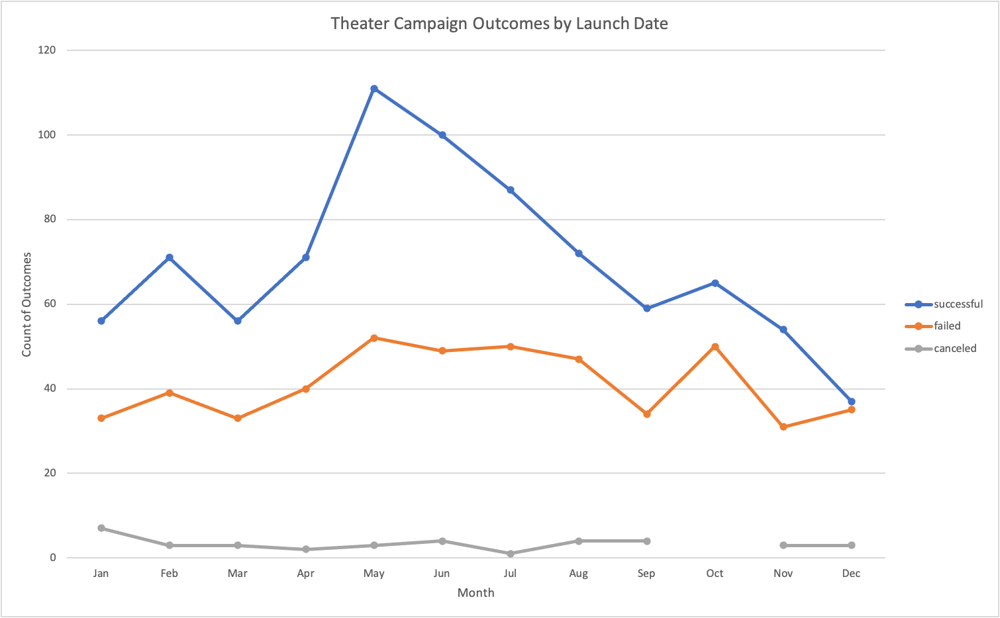
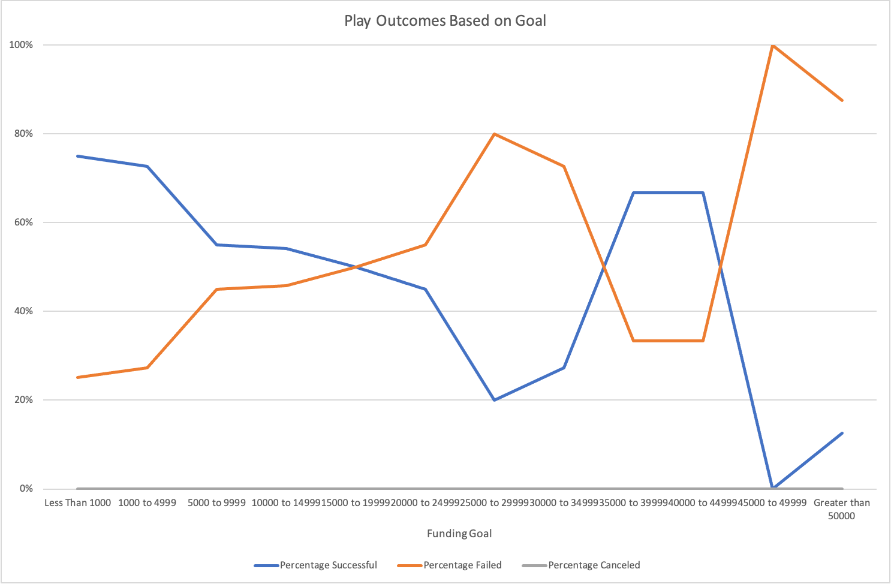

# Kickstarter Campaign Analysis Challenge Assignment
Author: Jerome Simmons

## Overview of Project
Louise is raising funds for a theater production. Her recent Kickstarter campaign was unsuccessful, so Louise needs to understand past campaign trends to revise and launch a successful campaign.

## Purpose
We will analyze previous Kickstarter campaign outcomes in order to inform future campaign fundraising strategy.

## Analysis and Challenges
The Kickstarter data set contains historical outcomes, which are not indicative of future performance. We lack qualitative insights and campaign strategies that may enhance campaign outcomes.

### Analysis of Outcomes Based on Launch Date
Theater campaigns tend to be successful, but campaign performance varies significantly by year.
* Overall, 61% of Theater campaigns were successful and 36% of Theater campaigns failed.
* All theater campaigns launched between 2011 and 2013 were successful, albeit limited in number (23 of 1369 observations)

Campaign success follows clear seasonal patterns. Theater campaigns launched in May have the highest likelihood of success compared to any other month and campaigns launched in December have the lowest likelihood of success.
* Over 66% of Theater campaigns (111/166) launched in May were successful.
* 49% of Theater campaigns (37/75) launched in December were successful and 47% failed.

### Analysis of Outcomes Based on Goals
The majority of plays set a fundraising goal below $4,999. In general, the fund raising goal and likelihood of success are negatively correlated. While there are a few projects that raised between $35,000 and $44,999 and succeeded 67% of the time, these projects represent a very small sample size.
* 75% of plays that raised less than $1,000 were successful and 25% failed.
* 73% of plays that raised between $1,000 and $4,999 were successful and 27% failed.
* Less than 13% of plays with a fund raising goal above $45,000 were successful and over 88% failed to reach their goal.

### Challenges and Difficulties Encountered
The data set offers limited information on who donated and why someone donated to a particular campaign. Our analysis platform (excel) is insufficient to perform text analysis, which limits our ability to draw key insights. 

## Results
Based on the analysis above, we have three recommendations:
1. Theater campaigns are a good space to run a fund raising campaign as they succeed more often than not.
2. Theater campaigns are most likely to succeed if launched in May.
3. Among plays, low fund raising goals are more likely to succeed. 

### Limitations of the dataset
While these recommendations align well with the analysis above, past performance is not indicative of future results. There may be other unforeseen factors that contribute to the success or failure of a fund raising campaign such as fund raiser awareness and reach. It is also possible that campaign description may impact the outcome. Overall, our data set provides very few signals on what prompted donors to pledge money toward a particular campaign.

### Additional Analysis
For additional analysis, we would recommend 
1. comparing Average Donation size and number of backers across successful and failed campaigns in order to understand the importance of audience composition on a campaign outcome.
2. analyzing text for keywords, number of words, parts of speech, or other signals that indicate a poorly or well-written description that may drive a campaign to succeed or fail.
